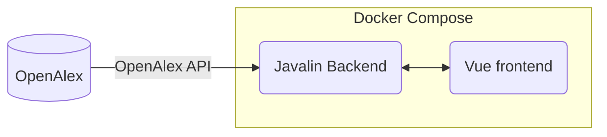

# Citature

Hello! Citature, which hasn't been created yet, will be a open-access, open-source bibliometrics application to search up and analyze research articles and its related information, such as authors, cited articles, related concepts, and more! This project is based off of the [OpenAlex project](https://openalex.org/), an open and comprehensive catalog of research papers.

## Structure

When completed, the project will consist of two parts:

At this point, the Javalin backend isn't really necessary; it only does some small data-processing and retrieving open access information from Unpaywall, another open-access data source. It *will* create graph objects for certain visualizations. However, I do see this becoming useful later on, when I would want to incorporate other data sources that may provide information on articles that haven't been logged in the OpenAlex database (DOI content negotiation).

## Goals & Plans
- [ ] Get the project functional
  - [x] Get the Javalin backend working (completed, may add more functionality)
  - [x] Get the Vue frontend working (only template project for now)
  - [ ] Create the Docker Compose file for it to work
- [ ] Create basic UI for Vue frontend
  - [ ] Add basic article information
  - [ ] Implement network graph
  - [ ] Add related sources (get information from Wikipedia)
- [ ] Make everything look fancy!
- [ ] Future Ideas:
  - [ ] Add author information from ORCID (when provided)
      - Can use [ORCID content negotiation](https://github.com/ORCID/ORCID-Source/blob/master/CONTENT_NEGOTIATION.md)
  - [ ] Add further publishing information?
  - [ ] Add more data source (DOI content negotiation, Semantic Scholar)
    - Note: There's not really any need to add data sources such as PubMed and ARXIV, since OpenAlex does catalog these sources. It *would* be nice, however.
  - [ ] Could add a general search for concepts, text, etc.
