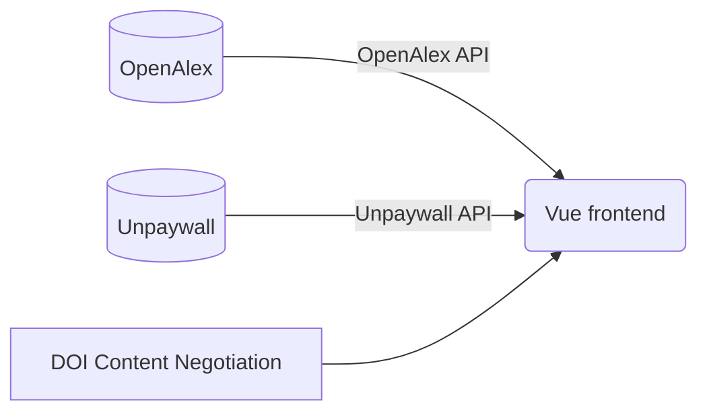

# Citerva

Hello! Citerva is an open-access, open-source bibliometrics application to search up and analyze research articles and its related information, such as authors, cited articles, related concepts, and more! This project is based off of the [OpenAlex project](https://openalex.org/), an open and comprehensive catalog of research papers.

## Structure

## Goals & Plans
- [ ] Implement network graph
- [ ] Future Ideas:
  - [ ] Add author information from ORCID (when provided)
      - Can use [ORCID content negotiation](https://github.com/ORCID/ORCID-Source/blob/master/CONTENT_NEGOTIATION.md)
  - [ ] Manage issues with publishing information when not provided.
  - [ ] Add more data source (DOI content negotiation, Semantic Scholar)
    - Note: There's not really any need to add data sources such as PubMed and ARXIV, since OpenAlex does catalog these sources. It *would* be nice, however.
  - [ ] Add a general search for concepts, text, etc.

## Useful Links for later
- https://github.com/ORCID/ORCID-Source/blob/master/CONTENT_NEGOTIATION.md
- https://github.com/citation-js/citation-js
- https://github.com/citation-js/replacer#starting.example
- https://github.com/Juris-M/citeproc-js
- https://www.semanticscholar.org/product/api
- https://api.semanticscholar.org/api-docs/graph#tag/Paper-Data
- https://github.com/allenai/s2orc-doc2json