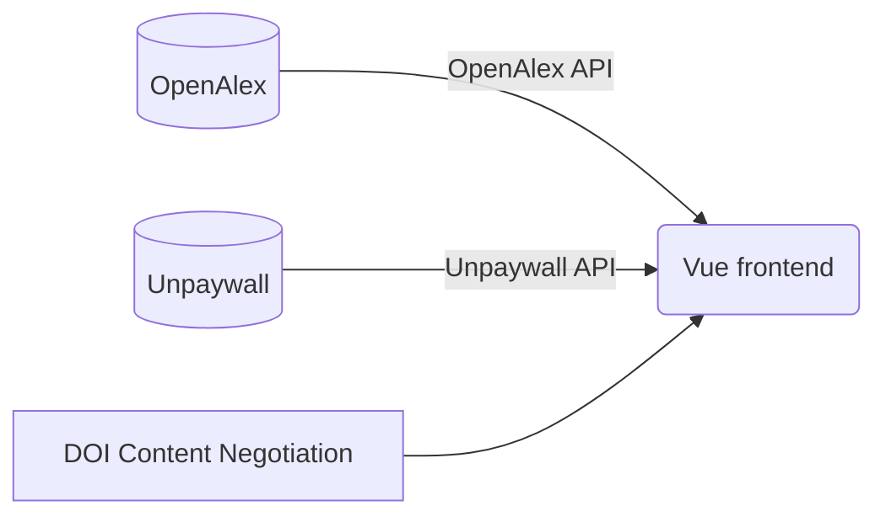

# Citerva

Hello! Citerva is an open-access, open-source bibliometrics application to search up and analyze research articles and its related information, such as authors, cited articles, related concepts, and more! This project is based off of the [OpenAlex project](https://openalex.org/), an open and comprehensive catalog of research papers.

## Structure

## Goals & Plans
- [ ] Make the results page fully functioning.
  - [ ] Basic search results
  - [ ] Filtering sidebar
  - [ ] Pagination
  - [ ] Sorting
- [ ] Add author information from ORCID (when provided)
- [ ] Page isn't functional on smaller screens. Fix responsiveness to function properly on mobile.
- [ ] Cache concept information so that data isn't requested multiple times due to tab switching.
- [ ] Make the citation section more robust.
  - [ ] Add more citation styles
  - [ ] Add sharing functionality
  - [ ] Add more citation information (e.g. DOI, PMID, etc.)
  - [ ] Add more citation formats (e.g. BibTeX, RIS, etc.)
- [ ] Possible move to Netlify functions completely?
  - [ ] Add more data sources (Semantic Scholar, DOI content negotiation, etc.)
- [ ] Future Ideas:
- [ ] Add more data source (DOI content negotiation, Semantic Scholar)
  - Biggest part is the Semantic Scholar TLDR, but this would require an API key, and the website's data would no longer be open-access.

## Useful Links for later
- https://github.com/ORCID/ORCID-Source/blob/master/CONTENT_NEGOTIATION.md
- https://github.com/citation-js/citation-js
- https://github.com/citation-js/replacer#starting.example
- https://github.com/Juris-M/citeproc-js
- https://www.semanticscholar.org/product/api
- https://api.semanticscholar.org/api-docs/graph#tag/Paper-Data
- https://github.com/allenai/s2orc-doc2json