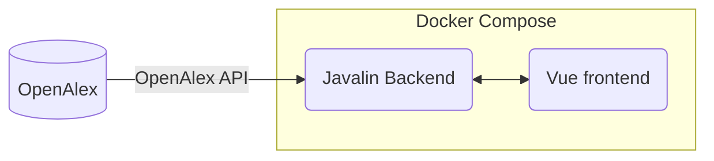

# Citature

Hello! Citature, which hasn't been created yet, will be a open-access, open-source bibliometrics application to search up and analyze research articles and its related information, such as authors, cited articles, related concepts, and more! This project is based off of the [OpenAlex project](https://openalex.org/), an open and comprehensive catalog of research papers.

## Structure

When completed, the project will consist of two parts:

## Goals
- [ ] Get the project functional
  - [ ] Get the Javalin backend working
  - [ ] Get the Vue frontend working
  - [ ] Create the Docker Compose file for it to work
